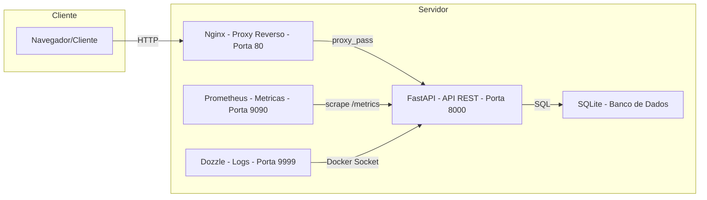
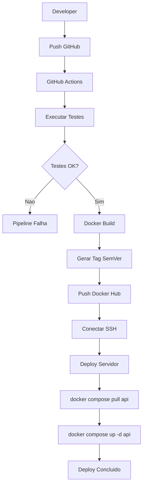
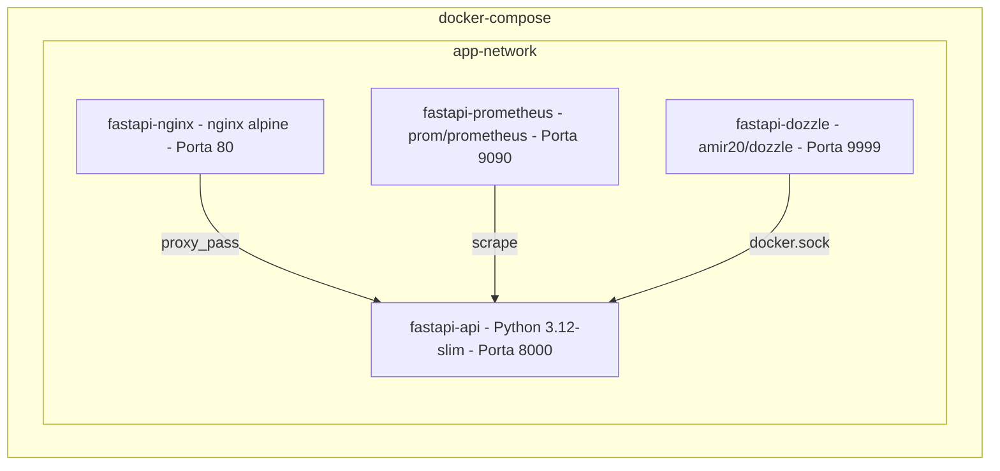
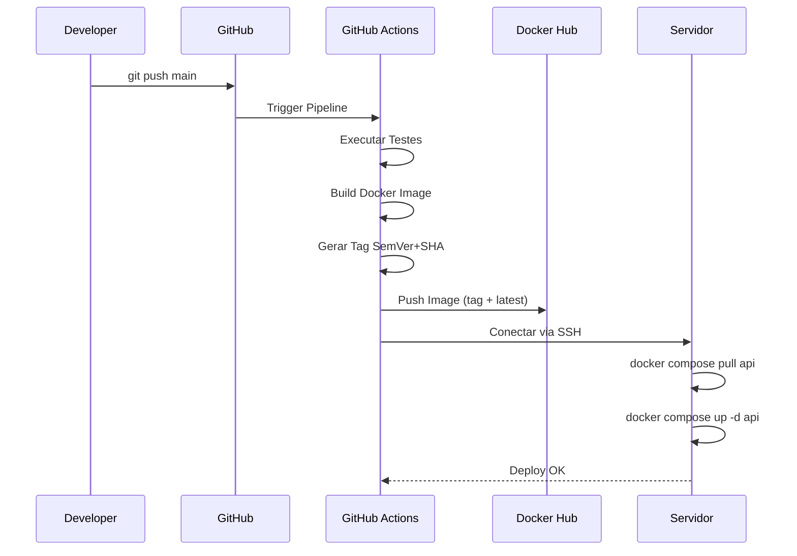
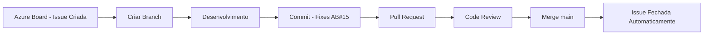

<](https://github.com/usuario/fastapi-seminario/actions)
[](https://www.python.org/)
[](https://fastapi.tiangolo.com/)
[](https://www.docker.com/)

Projeto completo demonstrando um pipeline de CI/CD moderno utilizando **FastAPI**, **Docker**, **GitHub Actions**, **Docker Hub**, **Nginx**, **Azure DevOps** e ferramentas de observabilidade como **Prometheus** e **Dozzle**.

---

## Indice

- [Objetivo](#objetivo)
- [Arquitetura](#arquitetura)
- [Tecnologias](#tecnologias)
- [Estrutura do Projeto](#estrutura-do-projeto)
- [Como Executar Localmente](#como-executar-localmente)
- [Como Executar com Docker](#como-executar-com-docker)
- [Pipeline CI/CD](#pipeline-cicd)
- [Deploy](#deploy)
- [Azure DevOps](#azure-devops)
- [Observabilidade](#observabilidade)
- [API Endpoints](#api-endpoints)
- [Versionamento](#versionamento)

---

## Objetivo

Desenvolver um projeto que represente um ambiente profissional de DevOps contendo:

- API REST com FastAPI pronta para producao
- Docker e Docker Compose para containerizacao
- GitHub Actions para CI/CD automatizado
- Versionamento SemVer + Short Hash do commit
- Publicacao automatica no Docker Hub
- Deploy automatico via SSH
- Proxy Reverso com Nginx
- Integracao GitHub + Azure DevOps
- Observabilidade com Prometheus e Dozzle
- Documentacao completa
- Codigo limpo, testado e comentado

---

## Arquitetura

### Diagrama Geral



### Fluxo do Pipeline CI/CD



### Containers Docker



### Fluxo de Deploy



### Fluxo Azure DevOps



### Infraestrutura


---

## Tecnologias

| Tecnologia | Versao | Descricao |
|------------|--------|-----------|
| Python | 3.12 | Linguagem principal |
| FastAPI | 0.115.0 | Framework web assincrono |
| Uvicorn | 0.30.6 | Servidor ASGI |
| SQLAlchemy | 2.0.35 | ORM para banco de dados |
| Pydantic | 2.x | Validacao de dados |
| Docker | latest | Containerizacao |
| Docker Compose | v2 | Orquestracao de containers |
| Nginx | alpine | Proxy reverso |
| Prometheus | latest | Coleta de metricas |
| Dozzle | latest | Visualizacao de logs |
| GitHub Actions | v4 | CI/CD |
| Azure DevOps | - | Gerenciamento de projeto |
| pytest | 8.3.3 | Testes automatizados |
| Black | 24.8.0 | Formatacao de codigo |
| Ruff | 0.6.8 | Linting |
| isort | 5.13.2 | Organizacao de imports |

---

## Como Executar Localmente

### Pre-requisitos

- Python 3.12+
- pip

### Passos

```bash
# 1. Criar ambiente virtual
python -m venv venv
source venv/bin/activate  # Linux/Mac

# 2. Instalar dependencias
make install

# 3. Configurar variaveis de ambiente
make env-setup

# 4. Executar a aplicacao
make run

# 5. Acessar a documentacao
# http://localhost:8000/docs
```

### Executar Testes

```bash
make test
```

### Lint e Formatacao

```bash
# Verificar
make lint

# Formatar automaticamente
make format
```

---

## Como Executar com Docker

```bash
# Build da imagem
make docker-build

# Subir todos os containers
make docker-up

# Verificar status
make docker-ps

# Ver logs
make docker-logs
```

### Servicos disponiveis

| Servico | URL | Descricao |
|---------|-----|-----------|
| API (via Nginx) | http://localhost | Acesso via proxy reverso |
| API (direto) | http://localhost:8000 | Acesso direto a API |
| Swagger Docs | http://localhost:8000/docs | Documentacao interativa |
| ReDoc | http://localhost:8000/redoc | Documentacao alternativa |
| Prometheus | http://localhost:9090 | Dashboard de metricas |
| Dozzle | http://localhost:9999 | Visualizacao de logs |
| Metricas | http://localhost:8000/metrics | Metricas Prometheus |

---

## Pipeline CI/CD

O pipeline e executado automaticamente via GitHub Actions a cada push na branch `main`.

### Etapas do Pipeline

| Etapa | Descricao | Detalhes |
|-------|-----------|----------|
| Testes | Executa lint e testes | Ruff, Black, isort, pytest |
| Build | Constroi imagem Docker | Com cache para otimizar |
| Tag | Gera versao SemVer | `VERSION-SHORT_SHA` |
| Push | Publica no Docker Hub | Tag versionada + latest |
| Deploy | Deploy via SSH | Atualiza apenas a API |

### GitHub Secrets Necessarios

| Secret | Descricao |
|--------|-----------|
| `DOCKER_USERNAME` | Usuario do Docker Hub |
| `DOCKER_PASSWORD` | Senha/Token do Docker Hub |
| `SERVER_IP` | IP do servidor de producao |
| `SERVER_USER` | Usuario SSH do servidor |
| `SSH_PRIVATE_KEY` | Chave privada SSH |

---

## Deploy

O deploy ocorre automaticamente via SSH apos o pipeline de CI/CD.

### Fluxo

1. GitHub Actions conecta ao servidor via SSH
2. Executa `docker compose pull api` para baixar a nova imagem
3. Executa `docker compose up -d api` para atualizar o container
4. Apenas o container da API e reiniciado; os demais permanecem ativos

### Deploy Manual

```bash
ssh user@servidor
cd ~/fastapi-seminario
docker compose pull api
docker compose up -d api
```

---

## Azure DevOps

### Integracao GitHub + Azure DevOps

O projeto utiliza Azure DevOps para gerenciamento de Issues e Pull Requests vinculados ao repositorio GitHub.

### Como funciona

1. Criar Issue no Azure DevOps Boards (ex: `AB#15`)
2. Criar branch vinculada a issue
3. Commits referenciam a issue: `git commit -m "feat: adiciona endpoint - Fixes AB#15"`
4. Pull Request vincula automaticamente a issue
5. Merge fecha automaticamente a issue

### Mensagens de Commit

```
feat: implementa CRUD de usuarios - AB#15
fix: corrige validacao de email - Fixes AB#15
docs: atualiza documentacao da API - AB#20
```

---

## Observabilidade

### Prometheus (Porta 9090)

Coleta metricas da aplicacao FastAPI:

- `http_requests_total` - Total de requisicoes HTTP
- `http_request_duration_seconds` - Duracao das requisicoes
- `http_request_size_bytes` - Tamanho das requisicoes
- `http_response_size_bytes` - Tamanho das respostas

Acesso: http://localhost:9090

### Dozzle (Porta 9999)

Visualizacao em tempo real dos logs de todos os containers Docker.

Acesso: http://localhost:9999

---

## API Endpoints

### Health e Info

| Metodo | Endpoint | Descricao |
|--------|----------|-----------|
| `GET` | `/health` | Health check |
| `GET` | `/info` | Informacoes da aplicacao |
| `GET` | `/metrics` | Metricas Prometheus |
| `GET` | `/docs` | Swagger UI |
| `GET` | `/redoc` | ReDoc |

### Usuarios (CRUD)

| Metodo | Endpoint | Descricao |
|--------|----------|-----------|
| `GET` | `/api/v1/users` | Listar usuarios (paginado) |
| `GET` | `/api/v1/users/{id}` | Buscar usuario por ID |
| `POST` | `/api/v1/users` | Criar novo usuario |
| `PUT` | `/api/v1/users/{id}` | Atualizar usuario |
| `DELETE` | `/api/v1/users/{id}` | Remover usuario |

---

## Versionamento

O projeto utiliza **SemVer** (Semantic Versioning) combinado com o Short Hash do commit Git.

### Formato

```
MAJOR.MINOR.PATCH-SHORT_SHA
```

### Exemplos

```
1.0.0-a2f4c9d
1.0.1-b3e5d8f
1.1.0-c4f6e9a
2.0.0-d5a7f0b
```

A tag e gerada automaticamente pelo GitHub Actions e utilizada como tag da imagem Docker:

```
usuario/fastapi-seminario:1.0.0-a2f4c9d
usuario/fastapi-seminario:latest
```

---

## Licenca

Este projeto e desenvolvido para fins educacionais como parte do Seminario de Computacao em Nuvem.

---

## Autor

**Matheus Andrade** - Seminario de Computacao em Nuvem
]]>
