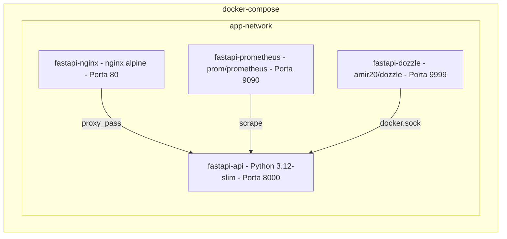
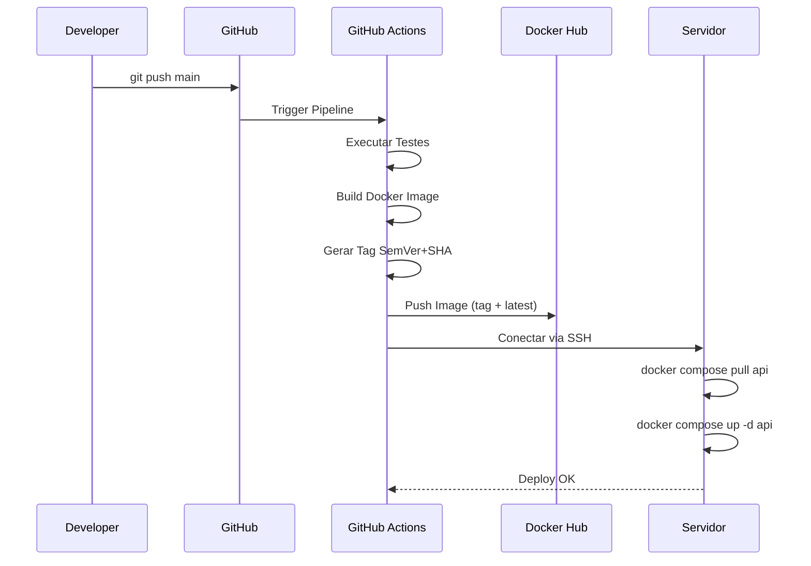
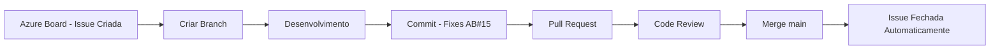
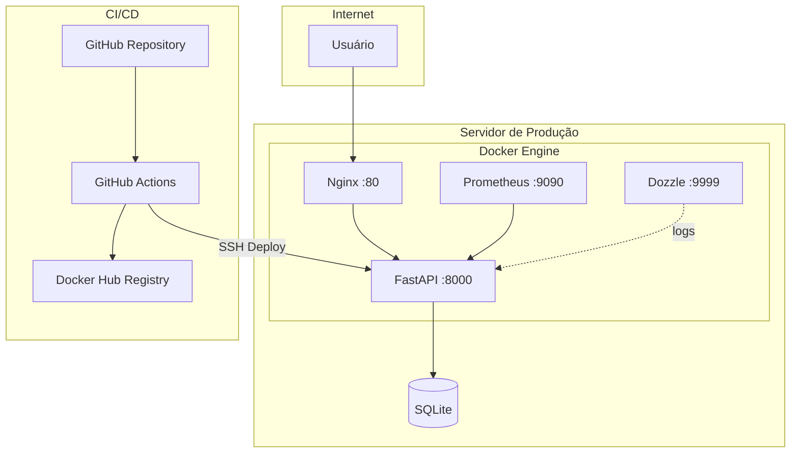

# Pipeline CI/CD

Projeto completo demonstrando um pipeline de CI/CD utilizando **FastAPI**, **Docker**, **GitHub Actions**, **Docker Hub**, **Nginx**, **Azure DevOps** e ferramentas de observabilidade como **Prometheus** e **Dozzle**.

---

## Índice

- [Objetivo](#objetivo)
- [Arquitetura](#arquitetura)
- [Tecnologias](#tecnologias)
- [Como Executar Localmente](#como-executar-localmente)
- [Como Executar com Docker](#como-executar-com-docker)
- [Pipeline CI/CD](#pipeline-cicd)
- [Deploy](#deploy)
- [Azure DevOps](#azure-devops)
- [Observabilidade](#observabilidade)
- [API Endpoints](#api-endpoints)
- [Versionamento](#versionamento)

---

## Objetivo

Desenvolver um projeto que represente um ambiente profissional de DevOps, contemplando:

- API REST com FastAPI pronta para produção.
- Docker e Docker Compose para conteinerização.
- GitHub Actions para automação de CI/CD.
- Versionamento SemVer combinado com o Short Hash do commit.
- Publicação automática de imagens no Docker Hub.
- Deploy automatizado via SSH.
- Proxy Reverso configurado com Nginx.
- Integração do fluxo de trabalho entre GitHub e Azure DevOps.
- Observabilidade de métricas e logs com Prometheus e Dozzle.
- Documentação completa da API.
- Código limpo, testado e comentado.

---

## Arquitetura

### Diagrama Geral


### Fluxo do Pipeline CI/CD


### Contêineres Docker



### Fluxo de Deploy



### Fluxo Azure DevOps



### Infraestrutura



---

## Tecnologias

| Tecnologia | Versão | Descrição |
|------------|--------|-----------|
| Python | 3.12 | Linguagem de programação principal |
| FastAPI | 0.115.0 | Framework web assíncrono para a API |
| Uvicorn | 0.30.6 | Servidor ASGI |
| SQLAlchemy | 2.0.35 | ORM para comunicação com o banco de dados |
| Pydantic | 2.x | Validação de dados e tipagem |
| Docker | latest | Conteinerização da aplicação |
| Docker Compose | v2 | Orquestração local dos contêineres |
| Nginx | alpine | Servidor web atuando como proxy reverso |
| Prometheus | latest | Coleta e armazenamento de métricas |
| Dozzle | latest | Interface web para visualização de logs |
| GitHub Actions | v4 | Ferramenta de automação de CI/CD |
| Azure DevOps | - | Gerenciamento de projeto e tracking de issues |
| pytest | 8.3.3 | Framework de testes automatizados |
| Black | 24.8.0 | Formatador de código |
| Ruff | 0.6.8 | Linter para análise estática |
| isort | 5.13.2 | Organizador de imports |

---

## Como Executar Localmente

### Pré-requisitos

- Python 3.12+
- Gerenciador de pacotes `pip`

### Passos

```bash
# 1. Criar o ambiente virtual
python -m venv venv
source venv/bin/activate  # Linux/Mac

# 2. Instalar as dependências
make install

# 3. Configurar as variáveis de ambiente
make env-setup

# 4. Executar a aplicação
make run

# 5. Acessar a documentação interativa
# O Swagger estará disponível em: http://localhost:8000/docs
```

### Executar Testes

```bash
make test
```

### Lint e Formatação

```bash
# Verificar adequação ao padrão de código
make lint

# Aplicar formatação automaticamente
make format
```

---

## Como Executar com Docker

```bash
# Fazer o build da imagem Docker
make docker-build

# Iniciar todos os contêineres em segundo plano
make docker-up

# Verificar o status dos serviços ativos
make docker-ps

# Visualizar os logs no terminal
make docker-logs
```

### Serviços Disponíveis

| Serviço | URL | Descrição |
|---------|-----|-----------|
| API (via Nginx) | http://localhost | Acesso à API através do proxy reverso |
| API (direto) | http://localhost:8000 | Acesso direto ao contêiner da API |
| Swagger Docs | http://localhost:8000/docs | Documentação interativa (OpenAPI) |
| ReDoc | http://localhost:8000/redoc | Documentação alternativa |
| Prometheus | http://localhost:9090 | Dashboard para consulta de métricas |
| Dozzle | http://localhost:9999 | Interface para visualização de logs do Docker |
| Métricas | http://localhost:8000/metrics | Endpoint consumido pelo Prometheus |

---

## Pipeline CI/CD

O pipeline é engatilhado automaticamente pelo GitHub Actions a cada *push* realizado na branch `main`.

### Etapas do Pipeline

| Etapa | Descrição | Detalhes |
|-------|-----------|----------|
| Testes | Executa análise estática e testes unitários | Utiliza Ruff, Black, isort e pytest |
| Build | Constrói a imagem Docker da API | Utiliza cache para otimizar o tempo de execução |
| Tag | Gera o versionamento SemVer | Formato: `VERSION-SHORT_SHA` |
| Push | Publica a imagem no Docker Hub | Sobe a imagem com a tag versionada e a tag `latest` |
| Deploy | Realiza o deploy automático no servidor via SSH | Atualiza exclusivamente o serviço da API |

### GitHub Secrets Necessários

Para que o pipeline funcione corretamente, os seguintes *secrets* devem ser configurados no repositório:

| Secret | Descrição |
|--------|-----------|
| `DOCKER_USERNAME` | Nome de usuário da conta do Docker Hub |
| `DOCKER_PASSWORD` | Senha ou Personal Access Token do Docker Hub |
| `SERVER_IP` | Endereço IP do servidor de produção |
| `SERVER_USER` | Usuário de autenticação SSH no servidor |
| `SSH_PRIVATE_KEY` | Chave privada SSH para acesso ao servidor |

---

## Deploy

O processo de deploy ocorre de forma automatizada (via SSH) assim que a esteira de CI/CD conclui o push da nova imagem.

### Fluxo de Atualização Automática

1. O GitHub Actions autentica no servidor de produção via SSH.
2. Executa o comando `docker compose pull api` para baixar a versão mais recente da imagem.
3. Executa o comando `docker compose up -d api` para recriar apenas o contêiner da aplicação.
4. Apenas o serviço da API é reiniciado; o Nginx, Prometheus e Dozzle permanecem ativos e sem interrupções.

### Deploy Manual

Caso precise forçar uma atualização diretamente no servidor:

```bash
ssh user@servidor
cd ~/fastapi-seminario
docker compose pull api
docker compose up -d api
```

---

## Azure DevOps

### Integração GitHub + Azure DevOps

Este projeto utiliza o Azure DevOps Boards para o gerenciamento ágil (Issues) integrado diretamente ao ciclo de vida dos *Pull Requests* no GitHub.

### Como Funciona

1. Cria-se uma Issue no Azure DevOps Boards (ex.: `AB#15`).
2. Cria-se uma branch no GitHub dedicada a esta funcionalidade/correção.
3. Os commits devem referenciar o ID da issue. Exemplo: `git commit -m "feat: adiciona endpoint - Fixes AB#15"`.
4. A abertura do Pull Request interliga automaticamente a discussão à respectiva issue no Azure.
5. Quando o Pull Request é mesclado (*merged*), a issue é encerrada automaticamente no painel.

### Padrão de Mensagens de Commit

Recomenda-se utilizar *Conventional Commits* com a referência do Azure:

```text
feat: implementa CRUD de usuários - AB#15
fix: corrige validação de e-mail - Fixes AB#15
docs: atualiza documentação da API - AB#20
```

---

## Observabilidade

### Prometheus (Porta 9090)

Ferramenta responsável por raspar e armazenar as métricas da aplicação FastAPI. Algumas das métricas coletadas incluem:

- `http_requests_total`: Contagem total de requisições HTTP.
- `http_request_duration_seconds`: Histograma de duração das requisições.
- `http_request_size_bytes`: Tamanho (em bytes) das requisições recebidas.
- `http_response_size_bytes`: Tamanho (em bytes) das respostas enviadas.

**Acesso:** http://localhost:9090

### Dozzle (Porta 9999)

Oferece visualização unificada e em tempo real dos logs gerados por todos os contêineres Docker da infraestrutura.

**Acesso:** http://localhost:9999

---

## API Endpoints

### Monitoramento e Informações

| Método | Endpoint | Descrição |
|--------|----------|-----------|
| `GET` | `/health` | Verifica a saúde da aplicação (*Health check*) |
| `GET` | `/info` | Exibe os metadados da aplicação e versão |
| `GET` | `/metrics` | Expõe as métricas no formato do Prometheus |
| `GET` | `/docs` | Acessa a interface do Swagger UI |
| `GET` | `/redoc` | Acessa a interface do ReDoc |

### Usuários (CRUD)

| Método | Endpoint | Descrição |
|--------|----------|-----------|
| `GET` | `/api/v1/users` | Lista todos os usuários (com suporte a paginação) |
| `GET` | `/api/v1/users/{id}` | Busca os detalhes de um usuário específico pelo ID |
| `POST` | `/api/v1/users` | Cadastra um novo usuário no sistema |
| `PUT` | `/api/v1/users/{id}` | Atualiza os dados de um usuário existente |
| `DELETE` | `/api/v1/users/{id}` | Remove um usuário do banco de dados |

---

## Versionamento

O projeto adota o padrão **SemVer** (Semantic Versioning), adicionando um sufixo correspondente ao *Short Hash* do commit do Git para garantir rastreabilidade.

### Formato

```text
MAJOR.MINOR.PATCH-SHORT_SHA
```

### Exemplos de Tags

```text
1.0.0-a2f4c9d
1.0.1-b3e5d8f
1.1.0-c4f6e9a
2.0.0-d5a7f0b
```

Essas tags são geradas de forma autônoma pelo GitHub Actions e atreladas às imagens exportadas para o repositório Docker:

```bash
usuario/fastapi-seminario:1.0.0-a2f4c9d
usuario/fastapi-seminario:latest
```

---

## Licença

Este projeto foi desenvolvido com propósitos estritamente educacionais, compondo a avaliação final do Seminário de Computação em Nuvem.

---

## Autor

**Matheus Andrade** - Seminário de Computação em Nuvem
